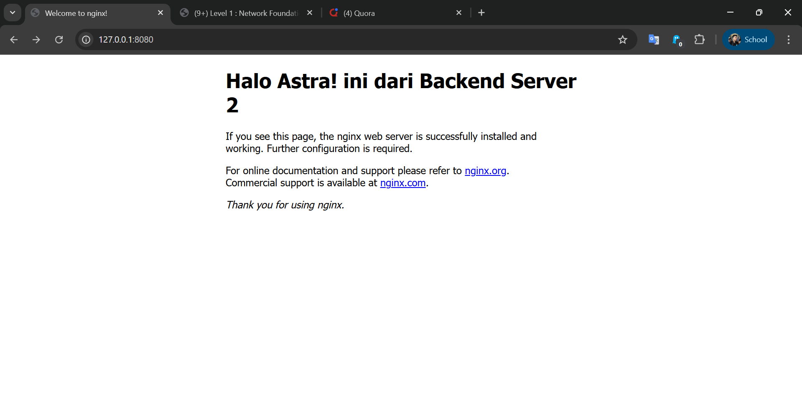

# 🛰️ Linux Gateway & High Availability Load Balancer

**Status:** ✅ Completed
**Role:** System Engineer Intern
**Stack:** Linux (Ubuntu Server), Nginx (Reverse Proxy & LB), VirtualBox, Bash, TCP/IP Networking

---

## 📌 Overview

Proyek ini mensimulasikan infrastruktur *On-Premise* kecil yang berevolusi dari sekadar gateway router menjadi **High Availability Layer 7 Load Balancer**.

Tujuan utama:

1. **Membangun Linux Gateway** untuk menghubungkan Private Subnet ke Internet.
2. **Mengimplementasikan Nginx Reverse Proxy (Layer 7 Load Balancing)** untuk mendistribusikan trafik ke beberapa backend.
3. **Melakukan Failover Simulation**, memastikan layanan tetap berjalan meskipun salah satu server mati.

---

## 🏗️ Infrastructure Topology

```
graph LR

    Internet((Internet/WAN))
    Internet -->|NAT| WAN[enp0s3 (DHCP)]

    subgraph "vLab-Router (Gateway + Load Balancer)"
        WAN --> Kernel[IP Forwarding]
        Kernel --> Nginx[Nginx Reverse Proxy / LB]
        Nginx --> LAN[enp0s8: 192.168.10.1]
    end

    User[Laptop Host] -->|HTTP/80| Internet

    subgraph "Backend Pool (Private Subnet)"
        LAN --> S1[Server-1: 192.168.10.2]
        LAN --> S2[Server-2: 192.168.10.3]
    end
```

### 💻 Host & VM Specs

* **Host Machine:** Asus Vivobook (16GB RAM)
* **Hypervisor:** VirtualBox 7.0
* **Router VM:** Ubuntu Server 22.04 (Nginx + IPTables NAT)
* **Backend VMs:** 2× Ubuntu Server 22.04 (Simple Web Server)

---

## ⚙️ Configuration & Implementation

---

### 1️⃣ Network Configuration (Netplan)

Menggunakan `systemd-networkd` sebagai renderer untuk stabilitas dan kecepatan.

**Router – `/etc/netplan/01-netcfg.yaml`:**

```
network:
  version: 2
  renderer: networkd
  ethernets:
    enp0s3:
      dhcp4: true       # WAN
    enp0s8:
      dhcp4: no         # LAN Gateway
      addresses:
        - 192.168.10.1/24
```

---

### 2️⃣ Nginx Load Balancer (Layer 7)

Nginx menggantikan metode DNAT lama agar routing lebih cerdas dan fleksibel.

**Nginx – `/etc/nginx/sites-available/default`:**

```nginx
# Backend server group
upstream astra_backend {
    server 192.168.10.2;  # Server-1
    server 192.168.10.3;  # Server-2
}

server {
    listen 80;
    server_name _;

    location / {
        proxy_pass http://astra_backend;

        # Preserve client information
        proxy_set_header Host $host;
        proxy_set_header X-Real-IP $remote_addr;
        proxy_set_header X-Forwarded-For $proxy_add_x_forwarded_for;
    }
}
```

---

### 3️⃣ Firewall & NAT (IPTables)

Dipakai **hanya** untuk Masquerading. Forwarding port ditangani oleh Nginx.

```bash
# MASQUERADE: memberi akses internet untuk private subnet
sudo iptables -t nat -A POSTROUTING -o enp0s3 -j MASQUERADE

# Persist rules across reboot
sudo netfilter-persistent save
```

---

## 🐛 Troubleshooting & Challenges

### **1. Netplan Config Hilang Setelah Reboot**

**Masalah:** Netplan selalu kembali ke DHCP karena Cloud-Init menimpa config.
**Solusi:** Disable modul network pada cloud-init.

```bash
echo "network: {config: disabled}" | sudo tee /etc/cloud/cloud.cfg.d/99-disable-network-config.cfg
sudo rm -f /etc/netplan/50-cloud-init.yaml
```

---

### **2. Load Balancing Tidak Terlihat (Browser Caching)**

**Masalah:** Browser modern menggunakan *Keep-Alive*, request tidak selalu “dialihkan”.
**Validasi:** Menggunakan `curl` atau Incognito membuktikan Round Robin bekerja.

---

## 🚀 High Availability Test

Semua uji dilakukan melalui HTTP (port 80) ke Gateway.

| Test Case      | Action                 | Expected Result                     | Actual Result | Status |
| -------------- | ---------------------- | ----------------------------------- | ------------- | ------ |
| Normal Traffic | Refresh berkali-kali   | Trafik bergantian S1 ↔ S2           | Sesuai        | ✅ PASS |
| Node Failure   | Server-1 dimatikan     | Semua request dialihkan ke Server-2 | Sesuai        | ✅ PASS |
| Recovery       | Server-1 hidup kembali | Kembali masuk rotasi otomatis       | Sesuai        | ✅ PASS |

---

## 📚 Project Note

Created as part of **System Engineer Intensive Roadmap** to strengthen foundational networking, Linux internals, and HA concepts.

---

## 📸 Evidence & Artifacts

**1. Load Balancing in Action**

*Browser secara otomatis dialihkan ke Server 2 saat Server 1 sibuk/mati.*

**2. Configuration Files**
Seluruh konfigurasi asli yang digunakan dalam lab ini dapat dilihat di folder [configs](./configs/).
* [Router Netplan](./configs/router/netplan.yaml)
* [Nginx Load Balancer Config](./configs/router/nginx.conf)


