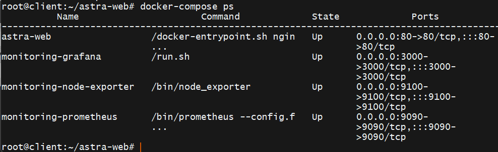
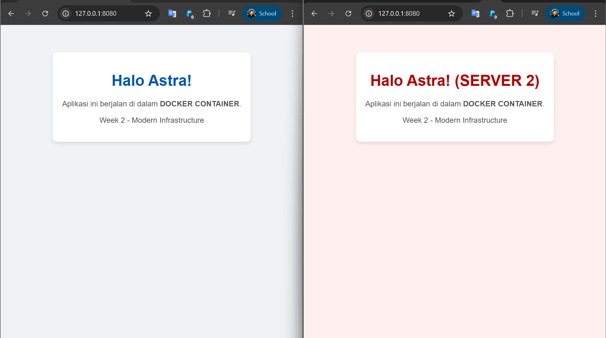
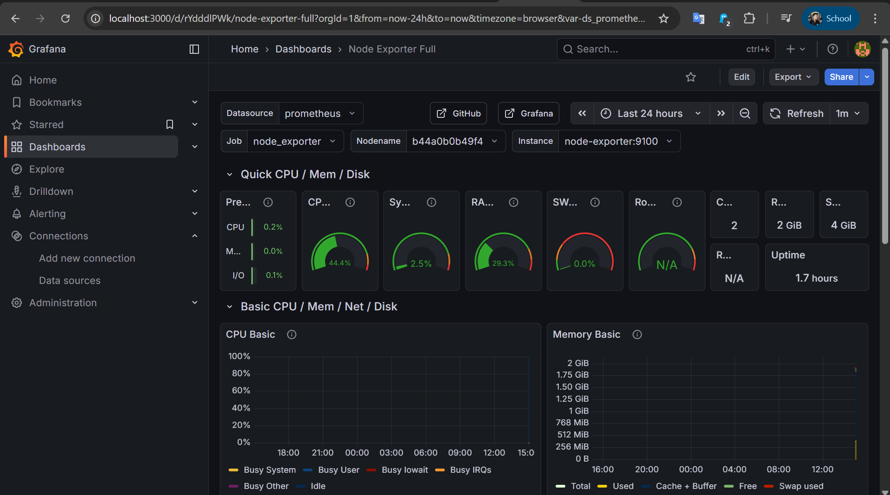

# Week 2: Modern Infrastructure & Containerization

## 🚀 Overview
Di minggu kedua ini, saya melakukan transformasi infrastruktur dari **Traditional VM** (Monolithic) menjadi **Containerized Microservices** menggunakan Docker. Fokus utamanya adalah efisiensi resource, kemudahan deployment, dan observabilitas sistem.

Saya juga mengimplementasikan **High Availability (HA)** stack dimana aplikasi berjalan secara paralel di dua node berbeda dan didistribusikan oleh Nginx Load Balancer, serta dipantau secara real-time.

## 🛠️ Tech Stack
- **Container Engine:** Docker
- **Orchestration:** Docker Compose
- **Web Server:** Nginx (Custom Image)
- **Monitoring:** Prometheus & Node Exporter
- **Visualization:** Grafana
- **Networking:** SSH Tunneling (untuk akses dashboard internal aman)

## 🏗️ Architecture
- **Host:** Linux VM (Ubuntu Server)
- **Load Balancer:** Nginx (Round Robin)
- **Services:**
  1. `web-astra`: Aplikasi web statis (HTML/CSS)
  2. `node-exporter`: Pengumpul metrik sistem (CPU/RAM)
  3. `prometheus`: Time-series database
  4. `grafana`: Dashboard visualisasi

## 📸 Documentation

### 1. Service Orchestration
Menjalankan seluruh stack infrastruktur (App + Monitoring) dengan satu perintah deklaratif:
`docker compose up -d`

### 2. High Availability & Load Balancing
Website dilayani oleh dua container berbeda. Jika satu container mati, trafik otomatis dialihkan ke container lain.

### 3. Real-time Monitoring Dashboard
Menggunakan "The Holy Trinity of Monitoring" (Prometheus + Grafana) untuk memantau kesehatan server secara live. Dashboard diakses melalui SSH Tunneling untuk keamanan.

## 📝 Key Learnings
- **Volume Mapping:** Teknik menyuntikkan source code dari Host ke Container secara live tanpa rebuild image.
- **Docker Networking:** Menghubungkan container Prometheus dengan Node Exporter dalam satu network internal.
- **Port Forwarding & Tunneling:** Mengakses service yang berjalan di private network (Grafana port 3000) melalui SSH Tunneling aman.

---
*Created by [Nama Kamu] - SysAdmin Journey*
