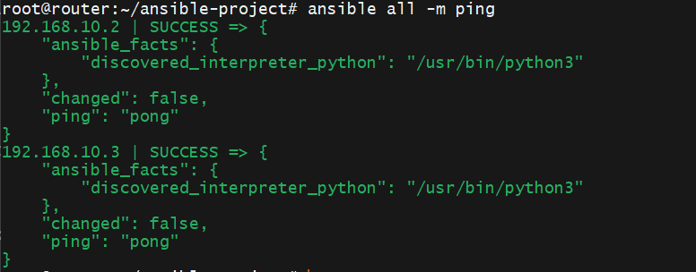
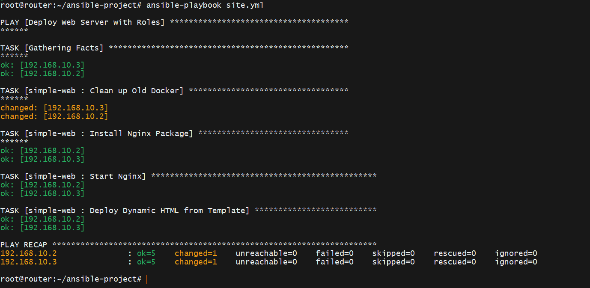
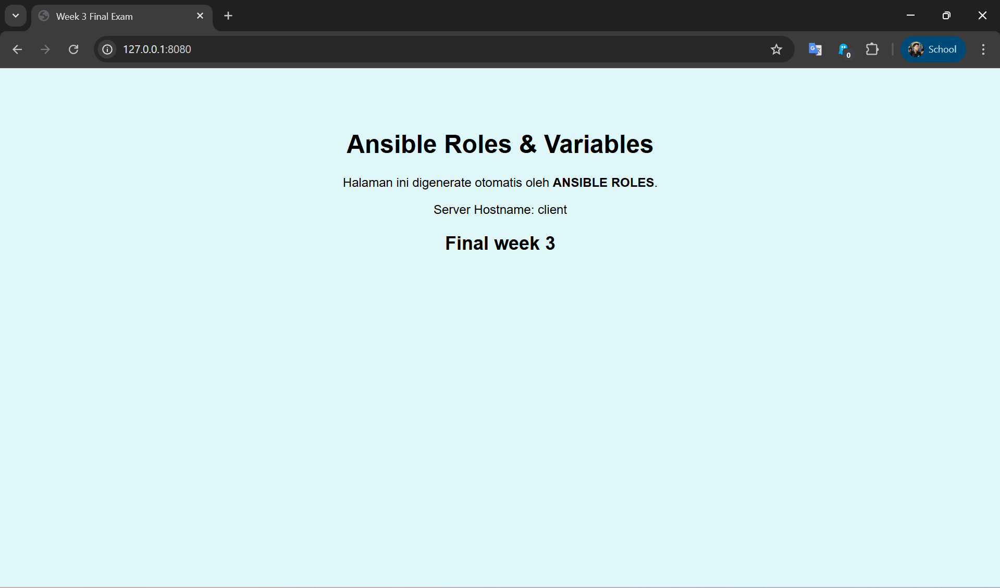

# Week 3: Infrastructure Automation with Ansible 🤖

## 🚀 Overview
Di minggu ketiga, saya beralih dari manajemen server manual (SSH satu per satu) ke **Otomatisasi Infrastruktur** menggunakan **Ansible**.
Tujuannya adalah mengelola konfigurasi server (*Configuration Management*) secara terpusat, konsisten, dan skalabel.

Saya mengubah topologi jaringan di mana **Router** kini bertindak sebagai **Control Node** yang memerintahkan **Client 1 & 2 (Managed Nodes)**.

## 🛠️ Tech Stack
- **Automation Tool:** Ansible Core
- **OS:** Ubuntu Server 20.04/22.04
- **Web Server:** Nginx (Native Install)
- **Templating:** Jinja2
- **Module:** Apt, Service, Shell, Template

## ⚙️ Key Implementations

### 1. SSH Key-Based Authentication
Menyiapkan komunikasi aman tanpa password (*Passwordless SSH*) antara Control Node dan Managed Nodes agar Ansible dapat bekerja tanpa intervensi manual.

### 2. Ad-Hoc Commands
Menggunakan perintah satu baris untuk tugas manajemen massal instan.
- **Ping Test:** `ansible all -m ping`
- **Monitoring Resource:** `ansible all -m shell -a "free -m"`
- **Package Management:** `ansible all -m apt -a "name=htop state=present"`

### 3. Ansible Playbooks & Idempotency
Membuat skenario otomatisasi (*Playbook*) untuk:
- Membersihkan container Docker sisa Week 2 (Clean Slate).
- Menginstall dan mengonfigurasi Nginx.
- Memastikan service berjalan dan *enabled* saat boot.
- Penerapan prinsip **Idempotency**: Ansible hanya melakukan perubahan jika kondisi target belum sesuai.

### 4. Roles & Variables (Best Practice)
Melakukan *refactoring* playbook menjadi struktur **Roles** yang modular:
- **Tasks:** Berisi logika instalasi.
- **Vars:** Menyimpan data dinamis (Judul web, Warna background).
- **Templates (Jinja2):** Membuat file HTML dinamis yang berubah kontennya sesuai variabel dan hostname server target.

## 📸 Documentation

### Ansible Ping & Ad-Hoc Commands

### Playbook Execution (Roles)

### Final Result (Dynamic Web Page)
*(Screenshot browser menampilkan website background biru muda dengan tulisan "Week 3 Final Exam")*

---
*Next Step: CI/CD Pipeline with GitHub Actions (Week 4)*