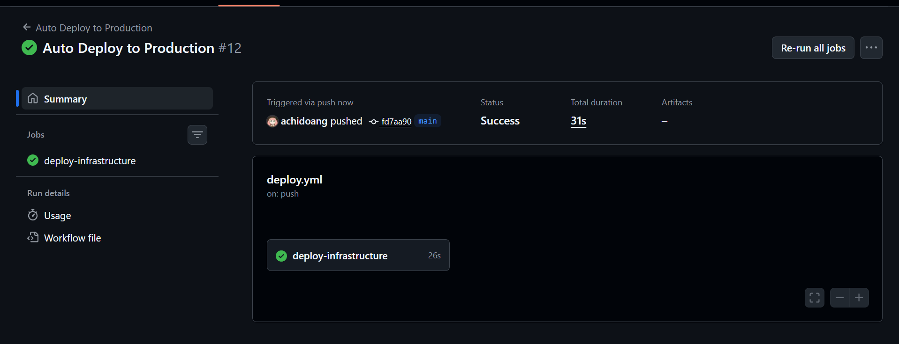

# Week 4: CI/CD Pipeline with GitHub Actions 🚀

## 🔄 Overview
Di minggu keempat, saya mengimplementasikan **DevOps Automation** sepenuhnya.
Tujuannya adalah menghilangkan intervensi manusia dalam proses deployment.
Sebelumnya, saya harus SSH ke server untuk menjalankan Ansible. Sekarang, server akan mengupdate dirinya sendiri setiap kali ada kode baru yang di-push ke GitHub.

## ⚙️ Architecture: Self-Hosted Runner
Karena server saya berada di jaringan privat (VirtualBox/Local), GitHub Cloud tidak bisa mengaksesnya secara langsung.
Solusinya:
1.  Saya menanam **GitHub Self-Hosted Runner** (Agent) di dalam node **Router**.
2.  Agent ini melakukan *Long Polling* ke GitHub, menunggu instruksi.
3.  Saat ada Job baru, Agent di Router akan mengeksekusi Ansible Playbook ke Client 1 & 2 melalui jaringan lokal.

## 🛠️ Implementation Details

### 1. The Workflow (`deploy.yml`)
Pipeline CI/CD ini otomatis berjalan ketika ada event: `push` ke branch `main`.
Langkah-langkah yang dilakukan robot:
1.  **Checkout Code:** Mengambil kodingan terbaru dari repository.
2.  **Execute Ansible:** Menjalankan `ansible-playbook` menggunakan environment yang sudah disiapkan di Router.

### 2. Configuration Management Update
Saya memperbaiki konfigurasi Ansible agar kompatibel dengan lingkungan CI/CD:
- **Absolute Paths:** Menggunakan path lengkap untuk SSH Key di file inventory.
- **Strict Host Checking Disabled:** Menonaktifkan verifikasi SSH interaktif agar robot tidak *stuck*.
- **Background Service:** Mengonfigurasi Runner agar berjalan sebagai `systemd service` yang aktif 24/7.

### 3. Rollback Strategy
Menguji ketahanan sistem dengan simulasi "Bad Deployment" (Deploy tampilan error).
Pemulihan dilakukan menggunakan **Git Revert**:
- `git revert HEAD` untuk membatalkan commit berbahaya.
- Pipeline otomatis mendeteksi commit revert tersebut dan mengembalikan server ke kondisi normal dalam hitungan detik.

## 📸 Evidence

### 1. Successful Deployment Pipeline
*(Screenshot GitHub Actions dengan Centang Hijau ✅ pada workflow "Auto Deploy to Production")*

### 2. Automated Web Update
*(Screenshot Website dengan background Kuning/Tulisan "CI/CD Success" setelah push)*

### 3. Rollback Action
*(Screenshot History GitHub yang menunjukkan commit "Revert" dan workflow yang berjalan sukses)*

---
