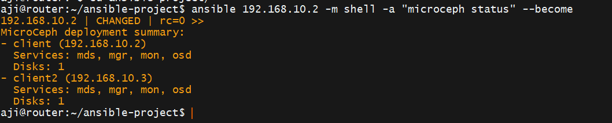
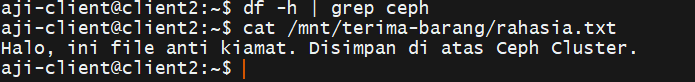

# Week 5: Distributed Block Storage with MicroCeph ☁️💾

## 🔄 Overview
Di minggu terakhir ini, saya membangun **High Availability Storage Cluster** menggunakan MicroCeph.
Tujuannya adalah memisahkan lapisan *Compute* dan *Storage*.
Saya menggabungkan raw disk dari beberapa node menjadi satu kolam penyimpanan terpusat (*Storage Pool*), memungkinkan data tetap bertahan meskipun salah satu node server mengalami kegagalan.

## ⚙️ Architecture
- **Storage Engine:** MicroCeph (Snap-based Ceph deployment).
- **Topology:** 2-Node Cluster (Hyper-converged).
- **OSD (Object Storage Daemon):** 2x 10GB Virtual Disk (/dev/sdb).
- **Storage Type:** Block Device (RBD).

## 🛠️ Implementation Steps

### 1. Automated Provisioning (Ansible)
Saya menggunakan Ansible untuk:
- Menginstall MicroCeph di seluruh node secara paralel.
- Memastikan user dan permission group terkonfigurasi dengan benar.
- Melakukan *System Hardening* agar service berjalan otomatis.

### 2. Clustering & OSD Setup
- Melakukan **Bootstrap** pada Node 1.
- Melakukan **Join Token** pada Node 2.
- Menambahkan Raw Disk (`/dev/sdb`) dari kedua node ke dalam pool OSD.

### 3. Failover Simulation (The "Kill" Test)
Skenario pengujian ketahanan data:
1.  Membuat Virtual Disk 5GB (`disk-rahasia`) dan mounting di **Client 1**.
2.  Menulis data penting (`rahasia.txt`).
3.  **Simulasi Failure:** Memutuskan koneksi Client 1 (Unmap/Shutdown).
4.  **Recovery:** Melakukan mapping disk tersebut di **Client 2**.
5.  **Result:** Data berhasil dibaca dengan sempurna di Client 2.

## 📸 Evidence

### 1. Cluster Status (2 Nodes, 2 OSDs)
*(Tempel Screenshot Status di sini)*

### 2. Data Persistence Test (Failover Success)
*(Tempel Screenshot Client 2 berhasil membaca file dari Client 1)*

---