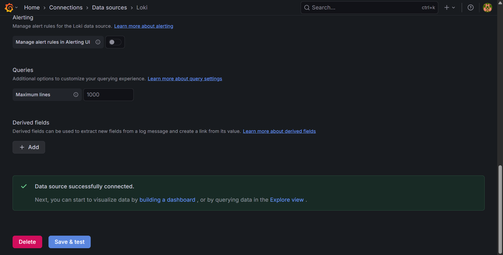
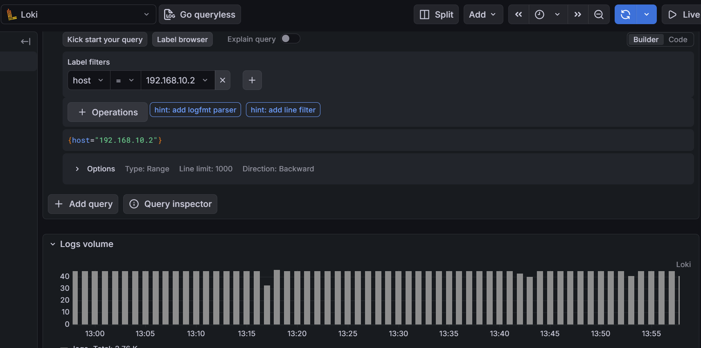
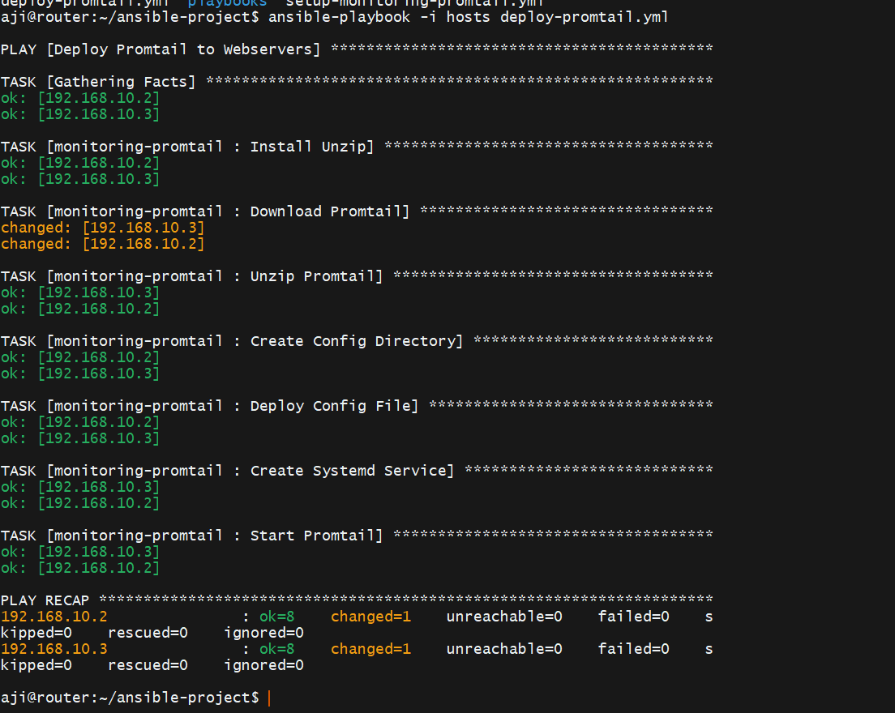
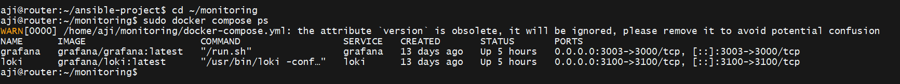

# Week 6: Centralized Logging Stack (Loki, Promtail, Grafana)

## Project Overview
Pada modul ini, saya membangun sistem **Centralized Logging** untuk memantau log dari multiple server (Client 1 & Client 2) secara terpusat di Server Router.

## Architecture
- **Loki (Router):** Log aggregation system (seperti Prometheus tapi untuk log).
- **Promtail (Clients):** Agent yang mengambil log dari `/var/log/syslog` dan mengirimnya ke Loki.
- **Grafana (Router):** Dashboard visualisasi untuk query log.

## Key Achievements
1.  **Infrastructure as Code:** Menggunakan Ansible untuk deploy Promtail ke semua client secara otomatis.
2.  **Log Aggregation:** Berhasil menarik log sistem dari 2 server berbeda ke satu dashboard.
3.  **Network Troubleshooting:** Mengatasi isu koneksi Docker Container menggunakan teknik Hairpinning (via Host IP) untuk integrasi Grafana-Loki.

## Screenshots
### 1. Grafana Data Source Connection (Success)

### 2. Log Explorer (Live Data from Clients)

### 3. Ansible Automation Output

### 4. Docker Containers
